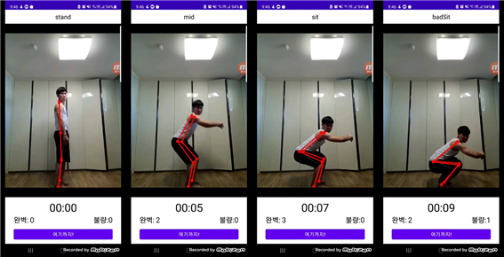

# 졸업 작품 - 하루 10분 스쿼트!!

## 사용 방법
- 소스 코드 확인:

      git clone https://github.com/Factoriall/Graduation_Project.git

  으로 clone 후 Android Studio로 켜서 확인

## 시스템

- MainActivity: 메인 화면, TimerFragment/RecordFragment 뷰를 가짐
	+ TimerFragment: 오늘의 기록을 보여주는 Fragment. Start 버튼을 누르면	CameraView로 넘어감.
	+ RecordFragment: 전체적인 누적 기록을 보여주는 Fragment, 전체 요약을 	보여주는 RecordOverallFragment, 하루하루 기록을 보여주는 			RecordOverallFragment로 나뉨
- CameraActivity: 실제로 카메라 화면을 보여주는 Activity, Stop 버튼 누르면 MainActivity의 TimerFragment 뷰로 돌아감
	+ PoseNet: 화면 정보 Frame을 활용해 실시간으로 관절 정보를 반환
- Database: 안드로이드 내장 DB인 SQLite 사용

## 기능

- 스쿼트 중인지 아닌지 판단

  1. Not Standing: 수직 관절 부분이 일자로 되어있지 않거나 수직 관절의 X축이 일정 길이를 넘지 않을 시
  2. Straight Standing: Not Standing 조건을 통과했으나 수평 관절 부분이 점 형태로 되지 않을 시
  3. Side Standing: 1, 2번 조건을 통과할 시. 이 자세로 유지할 시 스쿼트 중이라 판단.

- 스쿼트 중일 때 자세 파악

  1. Stand: 옆으로 서있는 자세, 이 상태에선 Timer가 작동이 되지 않음
    + 조건:　**왼쪽/오른쪽 무릎-발 vector 및 무릎-엉덩이 vector 각도 차이가 150도 이상**일 시
  2. Mid: Sit와 Stand 사이 자세, Timer 작동 시작 시점
    +조건: **왼쪽/오른쪽 무릎-발 vector 및 무릎-엉덩이 vector 각도 차이가 110도 ~ 150도** 일 시
  3. Sit: 옆으로 앉은 자세. 여기서 완벽 개수가 카운트됨.
    + 조건: **왼쪽/오른쪽 무릎-발 vector 및 무릎-엉덩이 vector 각도 차이가 110도 이하** 일 시
  4. badSit: 무릎이 앞으로 나온 자세. 불량 개수가 카운트되며, Sit에서 바뀔 시 완벽 카운트를 하나 줄임
    + 조건: **무릎-발 vector 및 바닥과 각도 차이가 50도 이하** 일 시

  - 사이드 자세가 풀릴 시 스쿼트 중이 아닌 상태로 되돌아감
  - Timer의 경우 Coroutine을 이용해 비동기 처리, Stand 상태가 될 시 타이머 stop을 하고 그 외에는 타이머를 작동 시킴.

- 전체 요약/오늘/각자의 기록

